# Brightly Bank — Agentic Banking Chatbot Demo

Ever wondered how a "simple" chatbot becomes a production banking system? This
demo shows the whole journey — starting from 3 boxes (chat UI → agent → LLM)
and building up, step by step, into a full 14-stage architecture: multi-agent
coordination, MCP-style tools, auth vs. authz, session memory, hybrid LLM +
PII redaction, prompt-injection guardrails, evals, observability, cost
tracking, and human-in-the-loop approvals. Everything here actually runs —
clone it, chat with it, and watch each concept click into place.

## Demo mode: skipping real OTP delivery

Step-up auth (Step 7) normally sends a real OTP by SMS. This demo has no SMS
provider wired up, so it gives you two ways to get past that step without
getting stuck:

1. **Default — OTP revealed in-chat.** When a sensitive action needs step-up
   auth, the bot's reply includes the demo OTP directly (`232144`), clearly
   labeled as demo-only. Just type it back. This still exercises the real
   challenge/response code path (`server/index.js`'s `session.pendingAuth`
   handling) — only the *delivery* mechanism is faked.
2. **Full bypass — `DEMO_SKIP_STEP_UP=true` in `.env`.** Treats every
   step-up check as pre-verified and executes the tool immediately. Useful
   when you want to walk through routing/authorization/MCP without pausing
   on identity for that beat of the demo.

To wire up real OTP delivery instead, replace the `DEMO_OTP` constant in
`server/mock-data/bank-db.js` with a per-challenge random code, persist it on
`session.pendingAuth`, and send it via Twilio/SNS/etc. where the demo
currently just prints it.

## Quick start

```bash
cd bank-agent-demo
npm install
cp .env.example .env
# edit .env and paste your key from https://console.anthropic.com
npm start
```

Open **http://localhost:3000**, pick **John** or **Sanjay**, and chat. Try:

- *"What's my balance?"* → routes to the Accounts Agent only.
- *"Get me my balance along with my last 5 transactions"* → Coordinator
  routes to **both** the Accounts Agent and Transaction Agent in parallel,
  then synthesizes one reply.
- *"Can you increase my credit limit to 500000?"* as **Sanjay** → denied
  immediately by policy (no permission) — this is **authorization**, not the
  model being polite.
- *"Can you increase my credit limit to 150000?"* as **John** → within his
  self-service ceiling, but still requires OTP step-up. Enter `232144` when
  asked.
- *"Can you increase my credit limit to 500000?"* as **John** → OTP step-up,
  then routes to **human approval** because it exceeds his self-service
  ceiling (see Approvals below).
- *"Can you increase my credit card limit to 500000, my card number is 1111
  2222 3333 44444"* → PII detector catches the card number and routes that
  turn to the **self-hosted** stub instead of the third-party LLM (hybrid
  strategy) — watch the terminal / trace to see the routing decision.

## Where each checklist item lives

| ✅ Checklist item | Files |
|---|---|
| Multi-agent design (Coordinator + domain sub-agents) | `server/agents/coordinator-agent.js`, `server/agents/{accounts,transaction,service}-agent.js`, `server/agents/agent-runtime.js` |
| MCP servers for tool abstraction | `server/mcp/*-mcp-server.js`, `server/mcp/index.js` |
| Authentication & Authorization (and why they're not the same) | `server/auth/authenticate.js` (Step 6) vs `server/auth/authorize.js` (Step 7) |
| Session management, conversation memory & inter-agent state | `server/db/session-store.js` |
| Hybrid LLM strategy — why PII never leaves the bank | `server/security/pii-redaction.js`, `server/llm/llm-router.js` |
| Prompt injection risks & guardrails (real attack scenario) | `server/security/prompt-injection-guard.js`, tested in `server/evals/eval-suite.js` |
| Agent evaluation pipelines | `server/evals/eval-suite.js`, `server/evals/run-evals.js` |
| Observability & tracing | `server/observability/tracer.js`, `GET /api/trace/:requestId` |
| Cost tracking & runaway-loop protection | `server/cost/cost-tracker.js` |
| Message queues, human-in-the-loop approval & async writes | `server/approvals/approval-queue.js`, `POST /api/approvals/:id/decision` |
| Production deployment, networking & failure handling | `server/security/edge-layer.js` + notes below |


## Architecture — step by step

Same diagrams as the original workshop deck, dropped straight in as images
so they render everywhere (GitHub, plain Markdown viewers, PDFs) without
needing Mermaid support. Each step is the *complete* picture as of that
point in the build — click to expand, and the code reference underneath
tells you exactly which file implements what you're looking at.

<details>
<summary><strong>Step 1 — A simple demo</strong></summary>

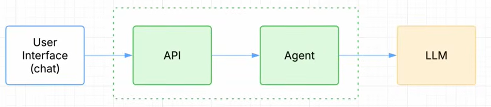

Three boxes. Chat UI → API → Agent → LLM. Nothing bank-specific yet.
Code: `public/index.html` → `server/index.js` → an agent → `server/llm/claude-client.js`.

</details>

<details>
<summary><strong>Step 2 — Give the agent access to the bank's internal data</strong></summary>

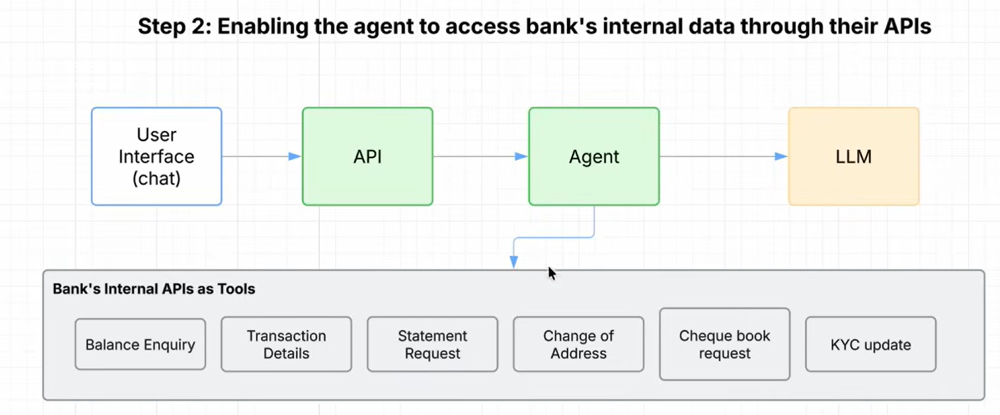

One agent, six tools, wired straight to the bank's internal APIs.
Code: `server/mcp/*-mcp-server.js` (`TOOLS` arrays).

</details>

<details>
<summary><strong>Step 3 — Domain-specific sub-agents, each scoped to only the tools it needs</strong></summary>

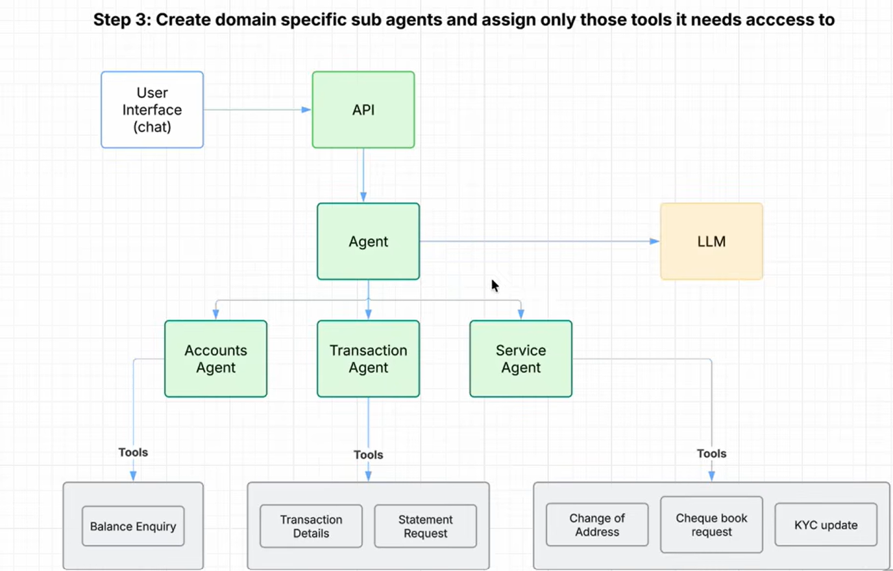

One agent holding 30-40 tools confuses the LLM about which one to use.
Splitting by domain keeps each agent's tool list small and obvious.
Code: `server/agents/accounts-agent.js`, `transaction-agent.js`, `service-agent.js`.

</details>

<details>
<summary><strong>Step 4 — Who decides which agent answers?</strong></summary>

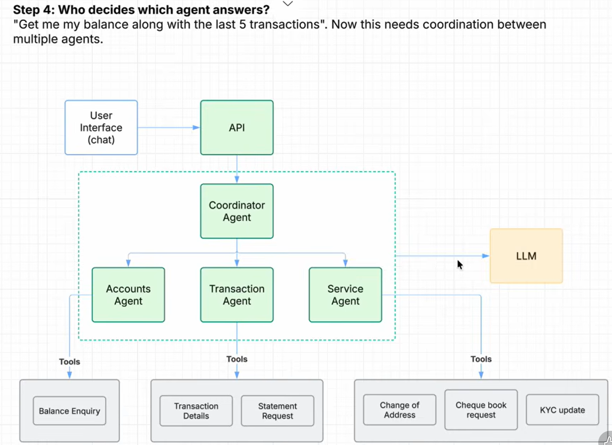

"Get me my balance along with my last 5 transactions" needs two sub-agents
at once. A Coordinator Agent routes to one or many sub-agents in parallel
and stitches their replies into one answer.
Code: `server/agents/coordinator-agent.js`.

</details>

<details>
<summary><strong>Step 5 — Expose tools via MCP servers for a loosely-coupled design</strong></summary>

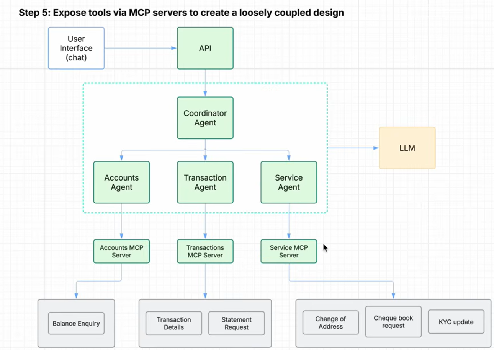

Without this layer, tool integration details get hard-coded straight into
agent logic. An MCP server sits between each sub-agent and the real bank
APIs, so the agent only ever sees a clean, versioned tool contract.
Code: `server/mcp/*-mcp-server.js`, `server/mcp/index.js`.

</details>

<details>
<summary><strong>Step 6 — Authentication ("who are you?")</strong></summary>

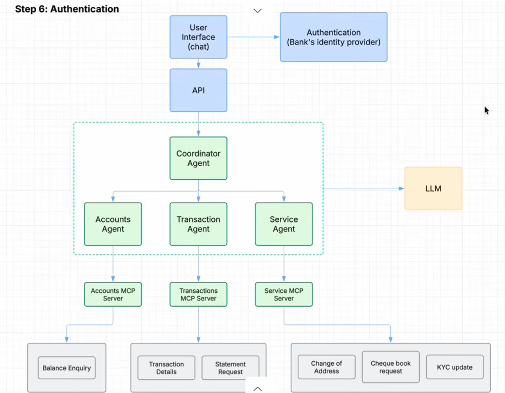

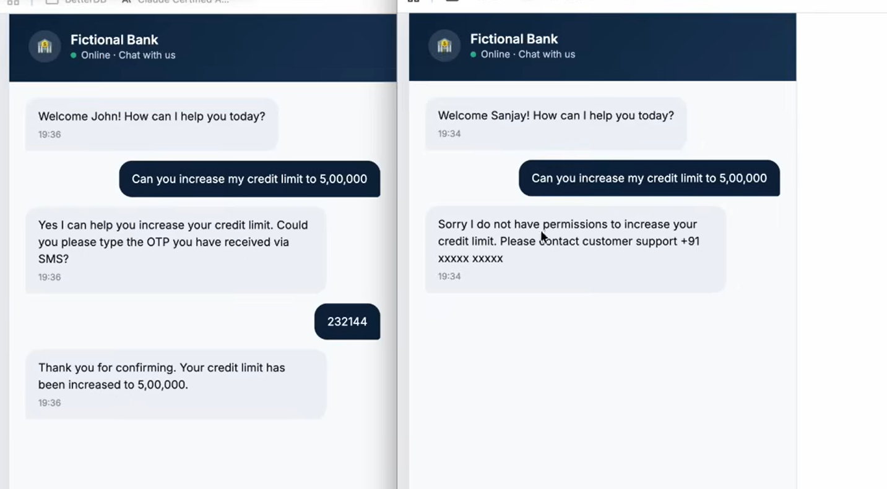

Authentication only establishes *who's talking*. Code:
`server/auth/authenticate.js` (`POST /api/auth/login` issues a JWT via the
bank's identity provider stand-in).

</details>

<details>
<summary><strong>Step 7 — Authorization ("what are you allowed to do?")</strong></summary>

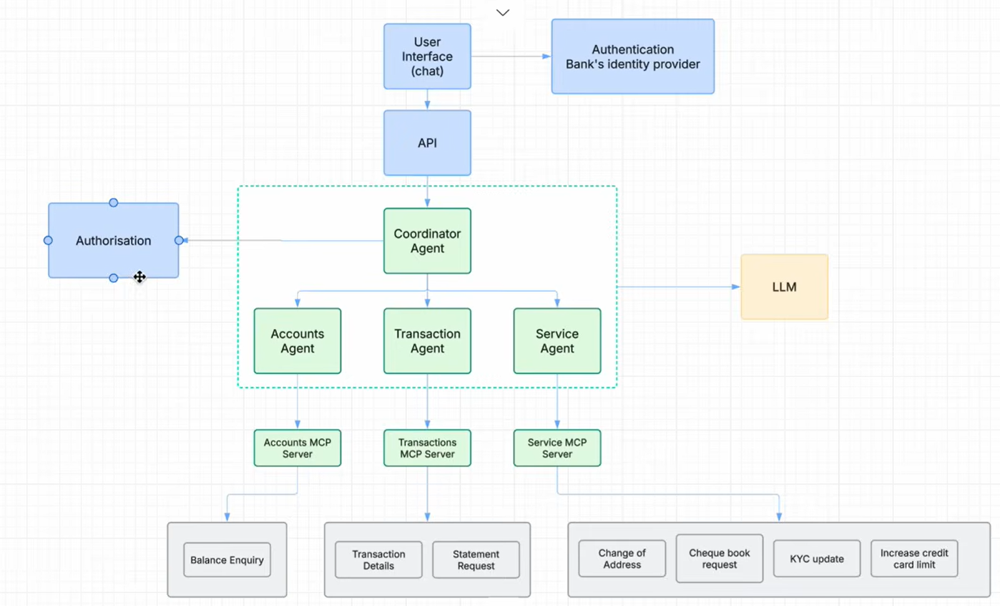

Authentication ≠ authorization: John and Sanjay both log in the exact same
way, but only John's *policy* allows a self-service credit-limit increase —
enforced in code, never left to the model to "decide".
Code: `server/auth/authorize.js` (`checkAuthorization`, the `POLICY` table).

</details>

<details>
<summary><strong>Step 8 — Session management</strong></summary>

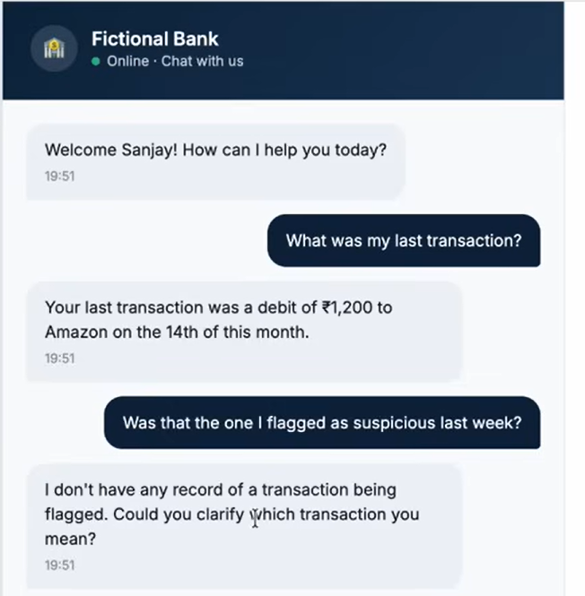

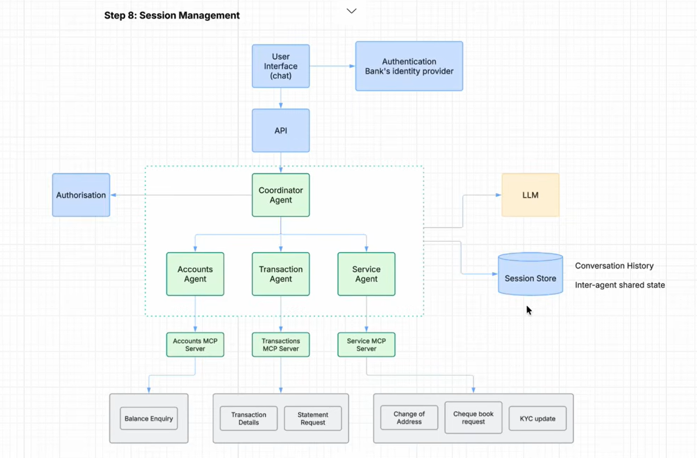

Without a session store, "Was that the one I flagged as suspicious last
week?" fails — nothing remembered the earlier turn.
Code: `server/db/session-store.js`.

</details>

<details>
<summary><strong>Step 9-10 — Hybrid LLM strategy: the card number that shouldn't leave the building</strong></summary>

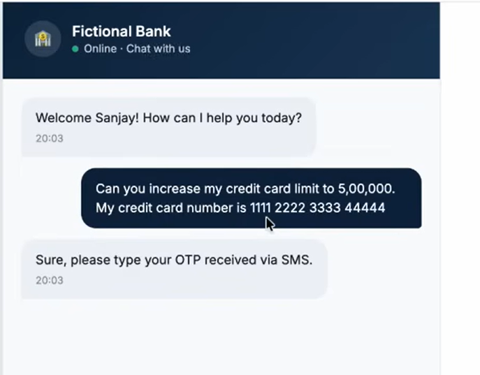

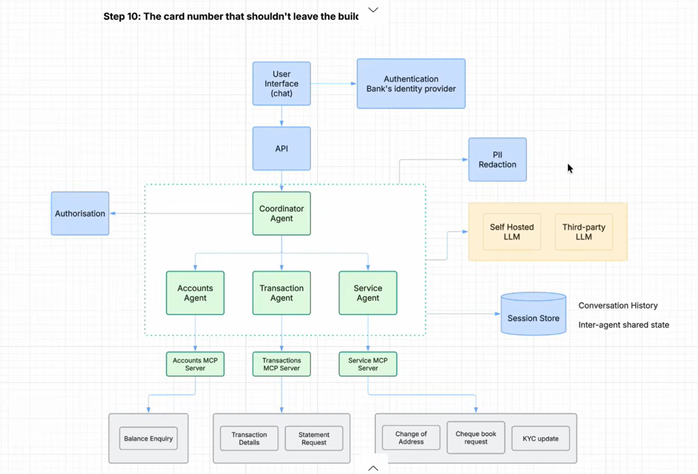

If that card number reaches a third-party LLM API as-is, it's left the
bank's infrastructure. PII Redaction scans every outgoing message; clean
text goes to the third-party LLM, anything still carrying PII routes to a
self-hosted model instead.
Code: `server/security/pii-redaction.js`, `server/llm/llm-router.js`.

</details>

<details>
<summary><strong>Step 11 — Agent evaluation pipelines</strong></summary>

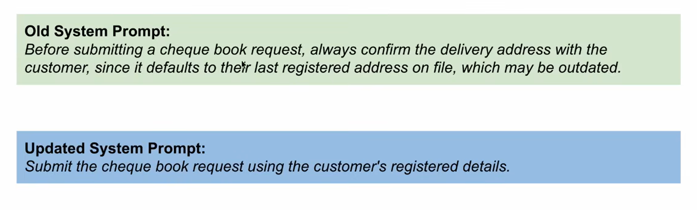

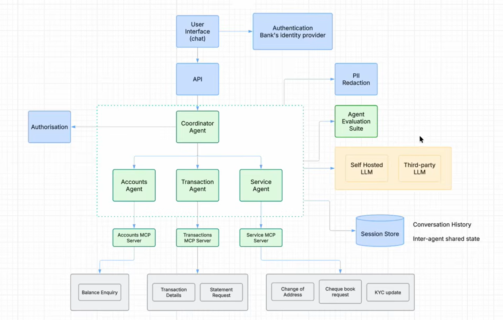

A "cleaner" system prompt silently dropped the instruction to confirm a
customer's delivery address before mailing a cheque book — nothing in a
normal chat session would catch that regression. The eval suite runs
scripted conversations against the real coordinator and asserts on
*behavior*, so a bad prompt change fails CI instead of failing a customer.
Code: `server/evals/eval-suite.js`, `server/evals/run-evals.js` (`npm run evals`).

</details>

<details>
<summary><strong>Step 12 — Observability: "Where did my system go wrong?"</strong></summary>

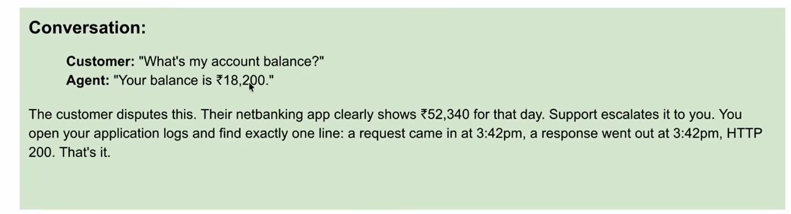

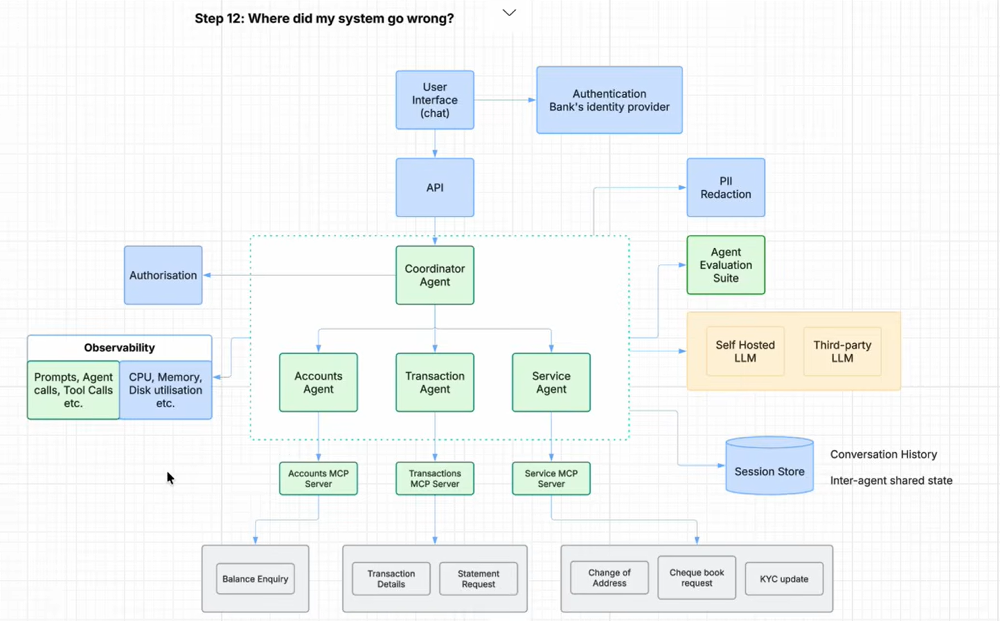

"A request came in, a response went out, HTTP 200" tells a support engineer
nothing when a customer disputes a balance. Every request instead gets a
structured, step-by-step trace — every prompt, routing decision, tool call,
and guardrail hit.
Code: `server/observability/tracer.js`, `GET /api/trace/:requestId`.

</details>

<details>
<summary><strong>Step 13 — Cost tracking & runaway-loop protection: "a bill that tripled"</strong></summary>

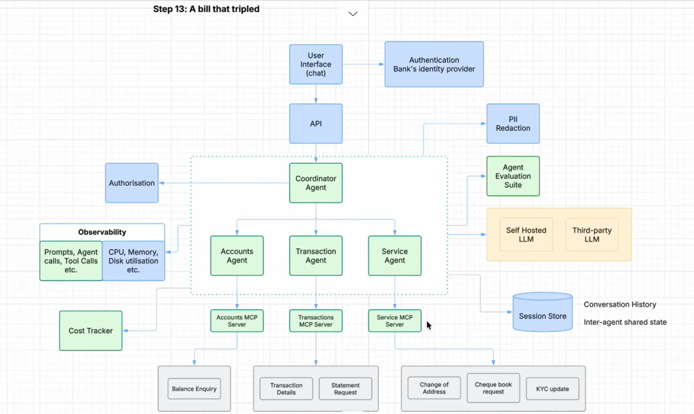

Every LLM call — coordinator, each sub-agent, the final synthesis — costs
money, and a confused agent can loop on the same tool call. This layer caps
LLM calls per user turn *and* enforces a per-session budget.
Code: `server/cost/cost-tracker.js` (`checkLoopLimit`, `checkBudget`).

</details>

<details>
<summary><strong>Step 14 — Edge layer security</strong></summary>

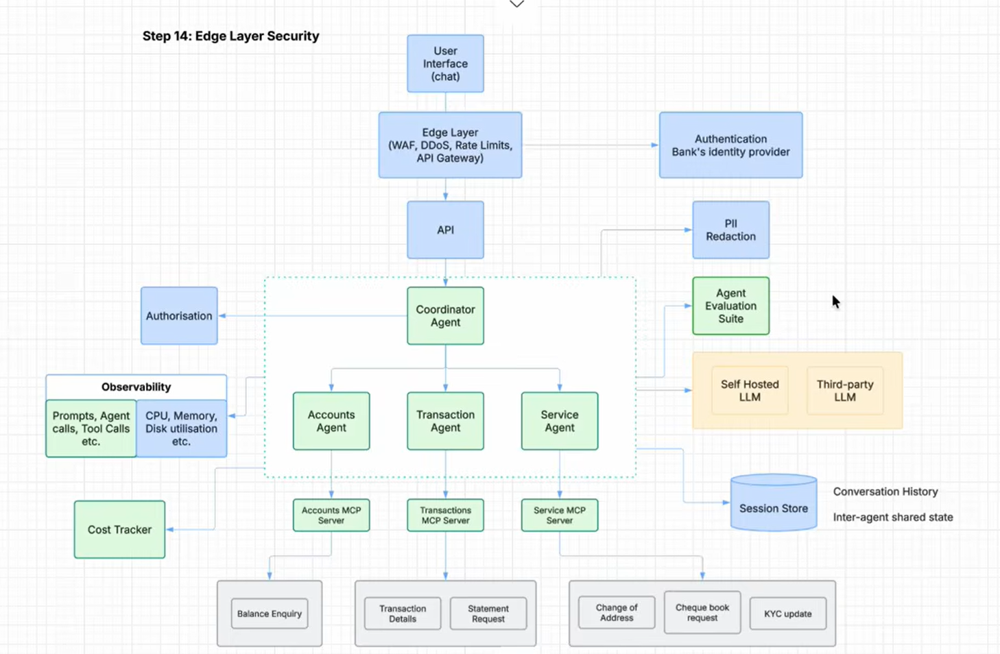

The complete architecture. Every request now passes through a WAF/rate
limiter/API gateway before it ever reaches application code — none of the
layers built in Steps 1-13 need to know this exists.
Code: `server/security/edge-layer.js`.

</details>


## Running the eval suite

```bash
npm run evals
```

This runs six scripted conversations against the **real** coordinator and
asserts on *behavior* (which tools got called, whether authorization was
enforced, whether the injection guard fired) — not exact text, since LLM
output isn't deterministic. One test is a live demonstration of the doc's
regression scenario: `server/agents/service-agent.js` currently has the
*safe* system prompt (confirm the address before a cheque book request).
Try swapping in the doc's "improved" prompt —
`Submit the cheque book request using the customer's registered details.`
— and see how the eval suite (and the story you'd tell about why evals
matter) changes.

## Human-in-the-loop approvals

When a request needs manual sign-off, it's written to an in-memory queue
instead of executed synchronously:

```bash
# See what's pending
curl http://localhost:3000/api/approvals -H "Authorization: Bearer <token>"

# Approve or reject
curl -X POST http://localhost:3000/api/approvals/<approvalId>/decision \
  -H "Authorization: Bearer <token>" -H "Content-Type: application/json" \
  -d '{"approve": true}'
```

In production this queue is a real broker (SQS/RabbitMQ/Kafka) and the
"approver" is a case-management UI for bank staff — the shape (enqueue →
pending → resolve → side effect) stays the same.

## Observability

Every request gets a `requestId`. Fetch its full trace — every routing
decision, tool call, authorization check, PII redaction, and injection
block — at:

```
GET /api/trace/:requestId
```

## What's simplified for the demo (and how to harden it for real use)

- **MCP servers are in-process modules**, not real MCP protocol servers over
  stdio/SSE. The tool-shaped interface (`TOOLS`, `callTool`) is the same
  shape a real `@modelcontextprotocol/sdk` server would expose — swapping in
  the real SDK is a contained change inside `server/mcp/`.
- **Session store, approval queue, and cost tracker are in-memory** (`Map`s).
  Swap for Redis/Postgres and a real broker for anything beyond a demo — the
  function signatures are deliberately small so this is a drop-in change.
- **The self-hosted LLM is a deterministic stub**, not a real on-prem model.
  It exists to make the hybrid-routing *decision* demonstrable without
  requiring a second model deployment for a classroom demo.
- **Edge layer** only implements rate limiting. A real deployment adds a WAF,
  DDoS protection, and API-gateway-level schema validation in front of this
  same Express app — none of which changes application code, which is the
  point of keeping them at the edge.
- **Failure handling**: add retries with backoff around `callClaude()` for
  transient API errors, and a circuit breaker if you're chaining multiple
  LLM calls per turn (this demo already caps loop length via
  `MAX_LLM_CALLS_PER_TURN`, which is the cheapest form of failure handling —
  bounding the blast radius of a confused agent).


# Path to production: cloud hosting, observability & the full delivery pipeline

Everything above runs as a single Node process with in-memory state — exactly
right for a classroom demo, wrong for production. This section is the honest
answer to "what changes when this ships for real": which in-memory module
gets replaced by which cloud-native service, and what a full ticket-to-alert
delivery pipeline looks like end to end.

## Cloud hosting & container platform

The app is already a stateless Express server, so containerizing it is a
small step — add a `Dockerfile`, push to a registry, run it anywhere that
runs containers. Pick based on team size and how much orchestration you
actually need:

| Platform | AWS | GCP | Azure | Best fit |
|---|---|---|---|---|
| Serverless containers | App Runner | Cloud Run | Container Apps | Smallest ops burden, spiky/low traffic, fastest to ship |
| Managed container orchestration | ECS (Fargate) | Cloud Run for Anthos | Container Apps | Mid-size team, some infra control, no cluster to manage |
| Full Kubernetes | EKS | GKE | AKS | Already standardized on k8s elsewhere in the org |

For this app specifically — a stateless API with no persistent local
storage once `session-store.js`/`approval-queue.js` move to real backing
stores (see below) — **serverless containers (Cloud Run / App Runner /
Container Apps) are the pragmatic default**: no cluster to patch, scales to
zero, and the whole point of Steps 1-14 was keeping every layer a plain
function call, which serverless containers don't fight against.

## Swapping in-memory modules for cloud-native services

Every `Map()` in this codebase is a clearly-labeled placeholder. Here's what
replaces each one in production:

| Demo module (in-memory) | Production replacement |
|---|---|
| `server/db/session-store.js` (`Map`) | Redis (ElastiCache / Memorystore) for hot session data; Postgres/DynamoDB if you need durable conversation history |
| `server/approvals/approval-queue.js` (`Map`) | Real message broker — SQS, Pub/Sub, or RabbitMQ — with a worker service (or Lambda) consuming it |
| `server/observability/tracer.js` (`Map`, console) | OpenTelemetry SDK in the app → OTLP exporter → CloudWatch/X-Ray, Datadog, or Grafana Tempo + Loki |
| `server/cost/cost-tracker.js` (`Map`) | Emit cost as a custom metric (CloudWatch Metrics / Datadog Custom Metrics) instead of holding it in process memory; pair with cloud billing tools below |
| Static `DEMO_OTP` | Real OTP via Twilio/SNS, short-lived code in Redis, not a constant |

## Observability & cost tracking, cloud-native

| Concern | AWS-native | Vendor-agnostic |
|---|---|---|
| Logs & traces | CloudWatch Logs + X-Ray | OpenTelemetry → Grafana Tempo/Loki, or Datadog |
| Dashboards & alerting | CloudWatch Dashboards + Alarms | Grafana + Prometheus, or Datadog Monitors |
| LLM-specific cost tracking | Custom metric per `costTracker.recordUsage()` call → CloudWatch → Budget alarm | Anthropic Console's usage dashboard for token-level spend, correlated with your own per-session metric |
| Infra cost tracking | AWS Cost Explorer + Budgets | Kubecost (if on Kubernetes), OpenCost |
| Alert routing | CloudWatch Alarm → SNS → Slack webhook | Datadog Monitor → Slack integration directly |

The `requestId`-per-trace pattern already in `tracer.js` maps directly onto
OpenTelemetry's `trace_id` — the instrumentation shape doesn't change, only
where the data ends up.

## The end-to-end delivery pipeline

This is the full loop from a requirement being written down to a production
alert firing in Slack. Steps in **solid** arrows are plain CI automation
(GitHub Actions can run them directly, including automated testing gated on
the SonarQube report); steps in *dashed* arrows involve an AI agent
(Claude Code / a review agent) and are triggered *by* CI but not fully
executed *inside* a YAML file.

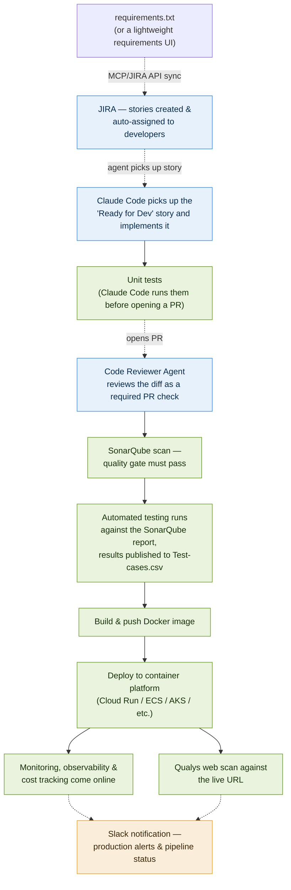

**Stage by stage:**

1. **Requirements → JIRA.** A change to `requirements.txt` (or a lightweight
   internal requirements UI) triggers a small sync script — this runs as a
   Claude Code task or a scheduled job using the **Atlassian Rovo MCP
   connector** (or the JIRA REST API directly), not literally inside a
   GitHub Actions runner, since MCP servers are invoked by an agent session.
   It creates/updates JIRA stories and assigns them based on a
   CODEOWNERS-style mapping.
2. **Claude Code implements the story.** Pointed at a "Ready for Dev" JIRA
   ticket, Claude Code checks out a branch, implements the change, and opens
   a draft PR.
3. **Unit tests.** Claude Code runs the project's test suite (for this repo,
   that's `npm run evals` plus any unit tests you add) before marking the PR
   ready — this step is fully scriptable in CI as a required check.
4. **Code Reviewer Agent.** A second Claude session, configured as a
   reviewer, reads the diff against the repo's conventions and leaves PR
   comments; merge is blocked until flagged issues are resolved. This is a
   GitHub Actions job that calls the Claude API on `pull_request` events.
5. **SonarQube quality gate.** Standard CI step — `sonar-scanner` runs on
   every push, and the quality gate (coverage %, code smells, vulnerability
   count) is a required status check before merge.
6. **Automated testing, gated on the SonarQube report.** Once the quality
   gate passes, an automated test runner executes against the codebase —
   driven by the SonarQube report's coverage/hotspot data to prioritize
   what gets exercised — and writes results straight to `Test-cases.csv`.
   No human sign-off in the loop here: a failing test run blocks the
   pipeline the same way a failed quality gate does.
7. **Build & deploy.** On merge to `main`, CI builds the Docker image, pushes
   to the registry, and deploys to whichever container platform you picked
   above.
8. **Observability & cost tracking come online** automatically once the new
   revision is live, using the cloud-native tooling from the table above.
9. **Qualys scan.** A post-deploy job kicks off a Qualys Web Application
   Scan against the live URL; the release isn't marked complete until the
   scan comes back clean (or with only accepted-risk findings).
10. **Slack alerts.** Deploy success/failure, quality-gate failures, scan
    findings, and any production alert (error-rate spike, cost anomaly)
    all route to a Slack channel via webhook — the last mile so a human
    finds out immediately, not by checking a dashboard.

A starter GitHub Actions workflow implementing the fully-automatable steps
(3, 5, 6, 7, 8-trigger, 10) is at
[`.github/workflows/ci-cd.yml`](.github/workflows/ci-cd.yml). The
agent-driven steps (1, 2, 4) are deliberately left as named placeholder
jobs in that file with comments explaining what real implementation
replaces them — wiring those up depends on which JIRA instance, which
Claude Code deployment mode, and which SonarQube/Qualys accounts you're
using, which isn't something a template file can guess for you.


