# Brightly Bank — Agentic Banking Chatbot Demo

A runnable, production-shaped reference implementation of the architecture in
*Bank-Chatbot.docx* — built for a student demo. It starts from 3 boxes (chat
UI → agent → LLM) and ends at the full 14-step diagram: multi-agent
coordination, MCP-style tools, auth vs. authz, session memory, hybrid LLM +
PII redaction, prompt-injection guardrails, evals, observability, cost
tracking, and human-in-the-loop approvals.

## Demo mode: skipping real OTP delivery

Step-up auth (Step 7) normally sends a real OTP by SMS. This demo has no SMS
provider wired up, so it gives you two ways to get past that step without
getting stuck:

1. **Default — OTP revealed in-chat.** When a sensitive action needs step-up
   auth, the bot's reply includes the demo OTP directly (`232144`), clearly
   labeled as demo-only. Just type it back. This still exercises the real
   challenge/response code path (`server/index.js`'s `session.pendingAuth`
   handling) — only the *delivery* mechanism is faked.
2. **Full bypass — `DEMO_SKIP_STEP_UP=true` in `.env`.** Treats every
   step-up check as pre-verified and executes the tool immediately. Useful
   when you want to walk through routing/authorization/MCP without pausing
   on identity for that beat of the demo.

To wire up real OTP delivery instead, replace the `DEMO_OTP` constant in
`server/mock-data/bank-db.js` with a per-challenge random code, persist it on
`session.pendingAuth`, and send it via Twilio/SNS/etc. where the demo
currently just prints it.

## Quick start

```bash
cd bank-agent-demo
npm install
cp .env.example .env
# edit .env and paste your key from https://console.anthropic.com
npm start
```

Open **http://localhost:3000**, pick **John** or **Sanjay**, and chat. Try:

- *"What's my balance?"* → routes to the Accounts Agent only.
- *"Get me my balance along with my last 5 transactions"* → Coordinator
  routes to **both** the Accounts Agent and Transaction Agent in parallel,
  then synthesizes one reply.
- *"Can you increase my credit limit to 500000?"* as **Sanjay** → denied
  immediately by policy (no permission) — this is **authorization**, not the
  model being polite.
- *"Can you increase my credit limit to 150000?"* as **John** → within his
  self-service ceiling, but still requires OTP step-up. Enter `232144` when
  asked.
- *"Can you increase my credit limit to 500000?"* as **John** → OTP step-up,
  then routes to **human approval** because it exceeds his self-service
  ceiling (see Approvals below).
- *"Can you increase my credit card limit to 500000, my card number is 1111
  2222 3333 44444"* → PII detector catches the card number and routes that
  turn to the **self-hosted** stub instead of the third-party LLM (hybrid
  strategy) — watch the terminal / trace to see the routing decision.

## Where each checklist item lives

| ✅ Checklist item | Files |
|---|---|
| Multi-agent design (Coordinator + domain sub-agents) | `server/agents/coordinator-agent.js`, `server/agents/{accounts,transaction,service}-agent.js`, `server/agents/agent-runtime.js` |
| MCP servers for tool abstraction | `server/mcp/*-mcp-server.js`, `server/mcp/index.js` |
| Authentication & Authorization (and why they're not the same) | `server/auth/authenticate.js` (Step 6) vs `server/auth/authorize.js` (Step 7) |
| Session management, conversation memory & inter-agent state | `server/db/session-store.js` |
| Hybrid LLM strategy — why PII never leaves the bank | `server/security/pii-redaction.js`, `server/llm/llm-router.js` |
| Prompt injection risks & guardrails (real attack scenario) | `server/security/prompt-injection-guard.js`, tested in `server/evals/eval-suite.js` |
| Agent evaluation pipelines | `server/evals/eval-suite.js`, `server/evals/run-evals.js` |
| Observability & tracing | `server/observability/tracer.js`, `GET /api/trace/:requestId` |
| Cost tracking & runaway-loop protection | `server/cost/cost-tracker.js` |
| Message queues, human-in-the-loop approval & async writes | `server/approvals/approval-queue.js`, `POST /api/approvals/:id/decision` |
| Production deployment, networking & failure handling | `server/security/edge-layer.js` + notes below |


## Architecture — step by step

Each diagram below is the complete picture *as of that step* — exactly how
the source workshop deck builds it up, one concept at a time. Node names
match the actual file/module that implements that box, so you can go from
diagram straight to code.

<details>
<summary><strong>Step 1 — A simple demo</strong></summary>

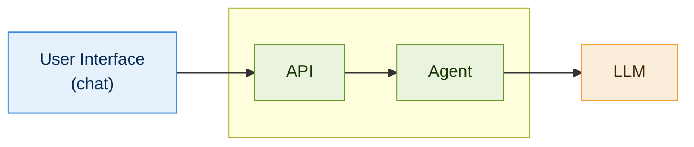

Three boxes. The chat UI calls an API, which hands the request to an Agent,
which calls an LLM. Nothing bank-specific yet — `public/index.html` → the
future `server/index.js` → an agent → `server/llm/claude-client.js`.

</details>

<details>
<summary><strong>Step 2 — Give the agent access to the bank's internal data</strong></summary>

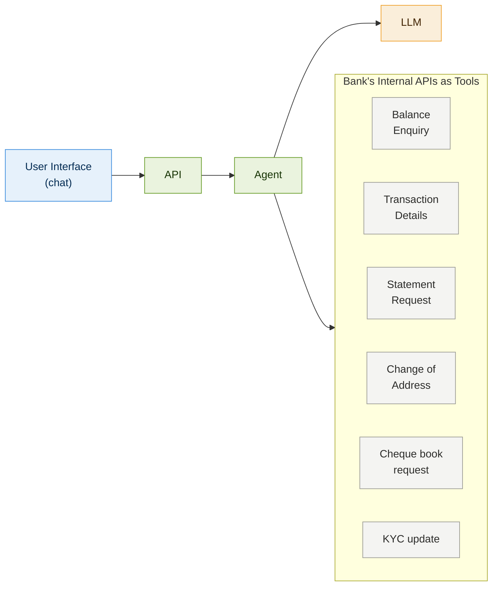

One agent, six tools. Works — until that "30 to 40 tools in real time"
problem hits: too many tools confuses the LLM about which one to use.
Code: `server/mcp/*-mcp-server.js` `TOOLS` arrays (still ungrouped at this stage).

</details>

<details>
<summary><strong>Step 3 — Domain-specific sub-agents, each scoped to only the tools it needs</strong></summary>

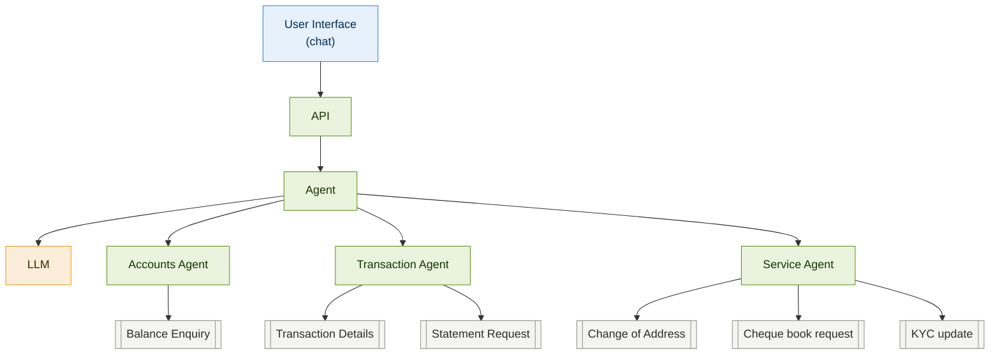

Splitting by domain shrinks each agent's tool list to 1-3 tools — each one
easy for the LLM to reason about. Code: `server/agents/accounts-agent.js`,
`transaction-agent.js`, `service-agent.js`.

</details>

<details>
<summary><strong>Step 4 — Who decides which agent answers?</strong></summary>

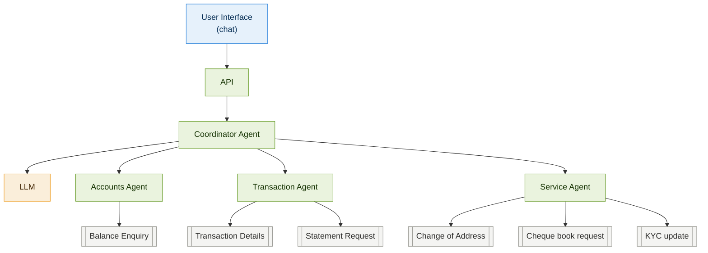

"Get me my balance along with my last 5 transactions" needs two sub-agents
at once. A Coordinator Agent routes to one or many sub-agents in parallel
and stitches their answers into one reply. Code:
`server/agents/coordinator-agent.js` (`ROUTING_TOOLS`, `handleTurn`).

</details>

<details>
<summary><strong>Step 5 — Expose tools via MCP servers for a loosely-coupled design</strong></summary>

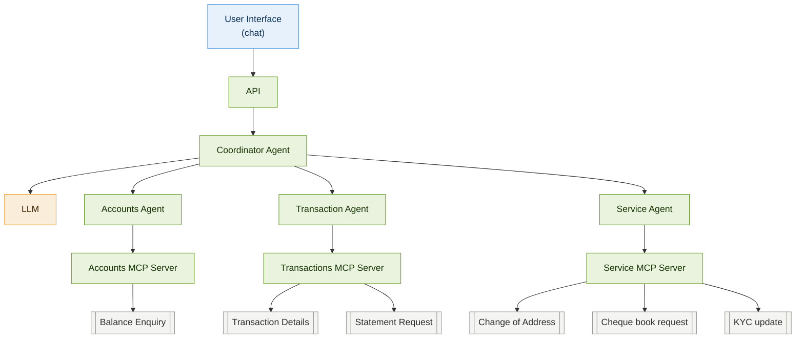

Without this layer, tool integration details (auth headers, error handling,
retries) get hard-coded straight into agent logic — tight coupling. An MCP
server sits between each sub-agent and the real bank APIs; the agent only
ever sees a clean, versioned tool contract. Code: `server/mcp/*-mcp-server.js`,
`server/mcp/index.js`.

</details>

<details>
<summary><strong>Step 6 — Authentication ("who are you?")</strong></summary>

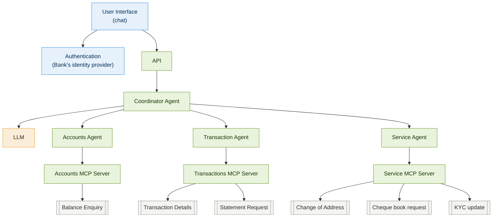

Establishes *who's talking* — nothing more. Code: `server/auth/authenticate.js`
(`POST /api/auth/login` issues a JWT via the bank's identity provider stand-in).

</details>

<details>
<summary><strong>Step 7 — Authorization ("what are you allowed to do?")</strong></summary>

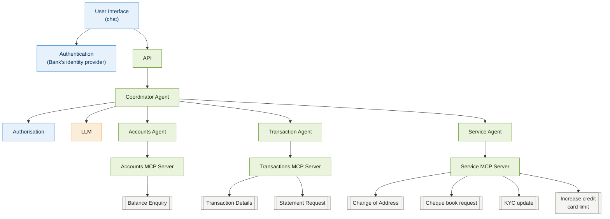

Authentication ≠ authorization: John and Sanjay both log in the exact same
way, but only John's *policy* allows a self-service credit-limit increase.
Enforced in code, never left to the model to "decide". Code:
`server/auth/authorize.js` (`checkAuthorization`, the `POLICY` table).

</details>

<details>
<summary><strong>Step 8 — Session management</strong></summary>

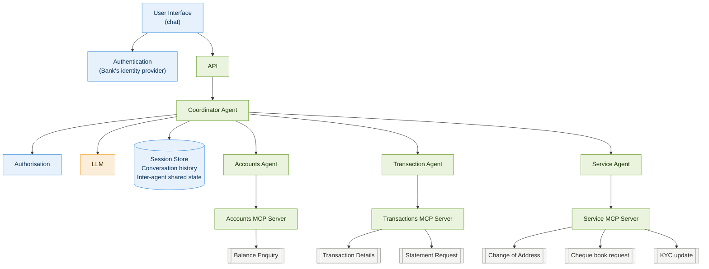

Without this, "Was that the one I flagged as suspicious last week?" fails —
nothing remembered the earlier turn. The session store holds both the raw
conversation and facts sub-agents leave for each other. Code:
`server/db/session-store.js`.

</details>

<details>
<summary><strong>Step 9-10 — Hybrid LLM strategy: the card number that shouldn't leave the building</strong></summary>

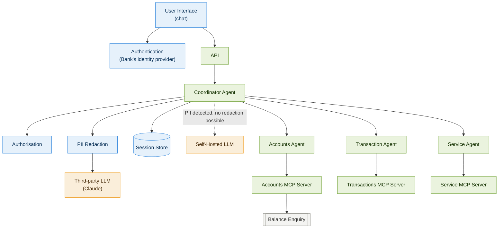

A customer types a raw card number in chat. If that string reaches a
third-party LLM API, it's left the bank's infrastructure. PII Redaction
scans every outgoing message; clean text goes to the third-party LLM,
anything still carrying PII after redaction routes to a self-hosted model
instead — the sensitive data never crosses the boundary either way. Code:
`server/security/pii-redaction.js`, `server/llm/llm-router.js`.

</details>

<details>
<summary><strong>Step 11 — Agent evaluation pipelines</strong></summary>

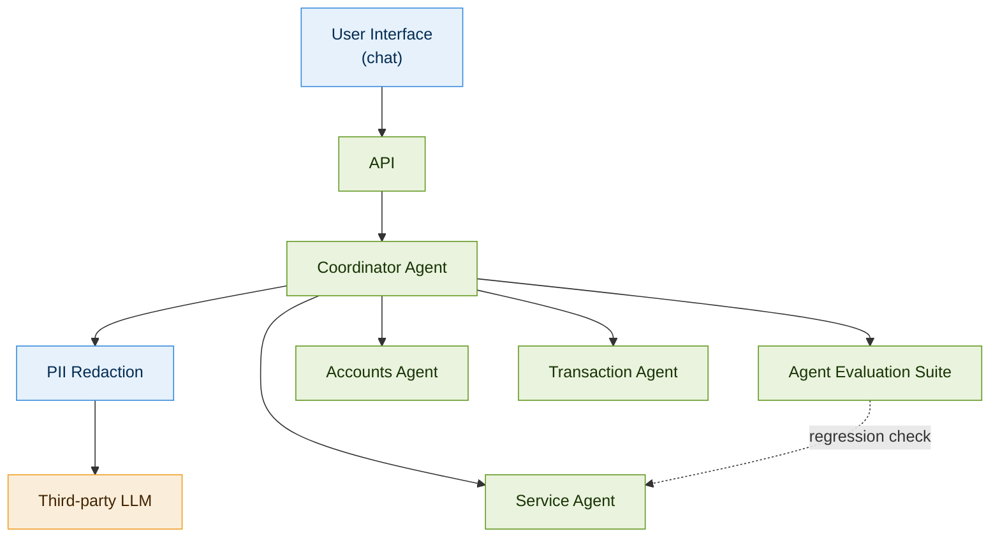

A "cleaner" system prompt silently dropped the instruction to confirm a
customer's delivery address before mailing a cheque book — nothing in a
normal chat session would catch that regression. The eval suite runs
scripted conversations against the real coordinator and asserts on
*behavior*, so a bad prompt change fails CI instead of failing a customer.
Code: `server/evals/eval-suite.js`, `server/evals/run-evals.js` (`npm run evals`).

</details>

<details>
<summary><strong>Step 12 — Observability: "Where did my system go wrong?"</strong></summary>

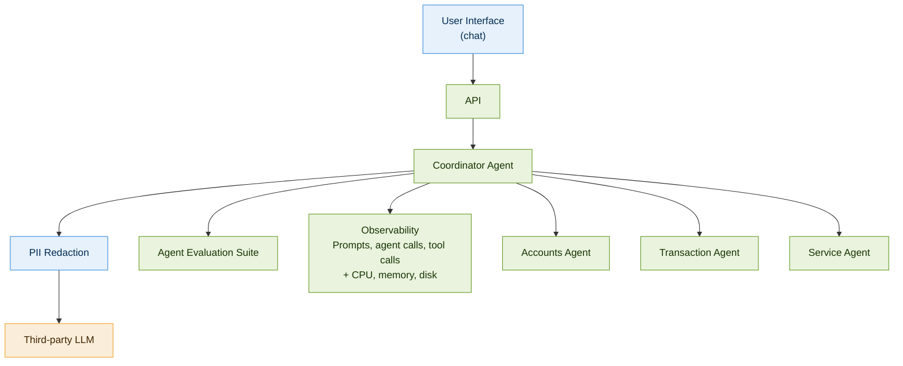

"A request came in, a response went out, HTTP 200" tells a support engineer
nothing when a customer disputes a balance. Every request gets a structured,
step-by-step trace instead — every prompt, routing decision, tool call, and
guardrail hit. Code: `server/observability/tracer.js`,
`GET /api/trace/:requestId`.

</details>

<details>
<summary><strong>Step 13 — Cost tracking & runaway-loop protection: "a bill that tripled"</strong></summary>

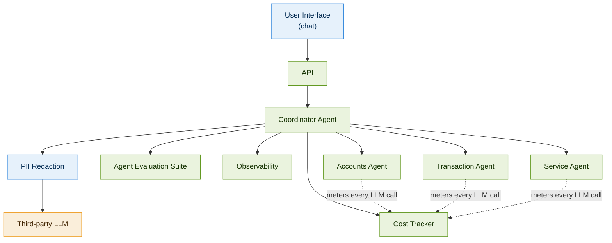

Every LLM call — coordinator, each sub-agent, the final synthesis — costs
money, and a confused agent can loop on the same tool call. This layer caps
LLM calls per user turn *and* enforces a per-session budget. Code:
`server/cost/cost-tracker.js` (`checkLoopLimit`, `checkBudget`).

</details>

<details>
<summary><strong>Step 14 — Edge layer security</strong></summary>

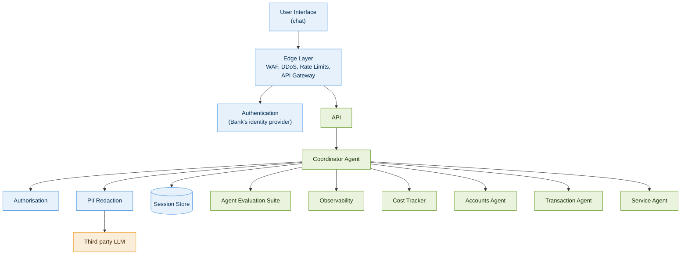

The complete architecture. Every request now passes through a WAF/rate
limiter/API gateway before it ever reaches application code — none of the
layers built in Steps 1-13 need to know this exists. Code:
`server/security/edge-layer.js`.

</details>

## Running the eval suite

```bash
npm run evals
```

This runs six scripted conversations against the **real** coordinator and
asserts on *behavior* (which tools got called, whether authorization was
enforced, whether the injection guard fired) — not exact text, since LLM
output isn't deterministic. One test is a live demonstration of the doc's
regression scenario: `server/agents/service-agent.js` currently has the
*safe* system prompt (confirm the address before a cheque book request).
Try swapping in the doc's "improved" prompt —
`Submit the cheque book request using the customer's registered details.`
— and see how the eval suite (and the story you'd tell about why evals
matter) changes.

## Human-in-the-loop approvals

When a request needs manual sign-off, it's written to an in-memory queue
instead of executed synchronously:

```bash
# See what's pending
curl http://localhost:3000/api/approvals -H "Authorization: Bearer <token>"

# Approve or reject
curl -X POST http://localhost:3000/api/approvals/<approvalId>/decision \
  -H "Authorization: Bearer <token>" -H "Content-Type: application/json" \
  -d '{"approve": true}'
```

In production this queue is a real broker (SQS/RabbitMQ/Kafka) and the
"approver" is a case-management UI for bank staff — the shape (enqueue →
pending → resolve → side effect) stays the same.

## Observability

Every request gets a `requestId`. Fetch its full trace — every routing
decision, tool call, authorization check, PII redaction, and injection
block — at:

```
GET /api/trace/:requestId
```

## What's simplified for the demo (and how to harden it for real use)

- **MCP servers are in-process modules**, not real MCP protocol servers over
  stdio/SSE. The tool-shaped interface (`TOOLS`, `callTool`) is the same
  shape a real `@modelcontextprotocol/sdk` server would expose — swapping in
  the real SDK is a contained change inside `server/mcp/`.
- **Session store, approval queue, and cost tracker are in-memory** (`Map`s).
  Swap for Redis/Postgres and a real broker for anything beyond a demo — the
  function signatures are deliberately small so this is a drop-in change.
- **The self-hosted LLM is a deterministic stub**, not a real on-prem model.
  It exists to make the hybrid-routing *decision* demonstrable without
  requiring a second model deployment for a classroom demo.
- **Edge layer** only implements rate limiting. A real deployment adds a WAF,
  DDoS protection, and API-gateway-level schema validation in front of this
  same Express app — none of which changes application code, which is the
  point of keeping them at the edge.
- **Failure handling**: add retries with backoff around `callClaude()` for
  transient API errors, and a circuit breaker if you're chaining multiple
  LLM calls per turn (this demo already caps loop length via
  `MAX_LLM_CALLS_PER_TURN`, which is the cheapest form of failure handling —
  bounding the blast radius of a confused agent).
